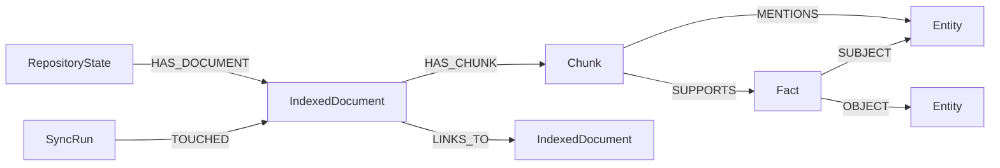

# MkDocs LlamaIndex and Neo4j Implementation Plan

## 1. Goal

Build a Python service that periodically synchronizes an authoritative MkDocs Git repository, incrementally indexes its Markdown documentation with LlamaIndex into Neo4j, and exposes retrieval to a LangGraph agent. Answers must include clickable links to the published documentation.

The index must converge to the checked-out repository state after additions, modifications, renames, deletions, history rewrites, interrupted runs, and relevant configuration changes. A normal synchronization should process only the delta.

## 2. Confirmed Requirements

- Source: an existing local Git clone of an MkDocs repository.
- Repository update: fetch and hard reset to a configured remote branch.
- Scope: Markdown files under the configured MkDocs `docs_dir`.
- Current corpus: approximately 462 Markdown files.
- Expected delta: approximately 10 changed files per synchronization.
- Runtime: Python services in Docker Compose.
- Schedule: a long-running worker polls at a configurable interval.
- Storage: self-hosted Neo4j in the same Docker Compose project.
- Retrieval: vector search plus a schema-guided knowledge graph.
- Agent: LangGraph first.
- Models: one self-hosted OpenAI-compatible base URL and API key.
- Candidate chat models: `qwen-3.6-27b`, `deepseek-v4-flash`.
- Candidate embedding models: `qwen3-embedding-0.6b`, `qwen3-embedding-8b`.
- Candidate reranker: `qwen3-reranker-0.6b`.
- Endpoint ingress: TLS termination at Traefik with authentication handled by OAuth2 Proxy.
- Example source mapping:
  - `docs/mosaic/devops/10_coding-agent-mgmt.md`
  - `https://mosaic.code.siemens.io/doc/mosaic/devops/10_coding-agent-mgmt/`

## 3. Recommended Baseline

Use two LlamaIndex retrieval structures backed by the same Neo4j database:

1. A chunk-level `VectorStoreIndex` backed by Neo4j for semantic retrieval, reranking, and direct source provenance.
2. A `PropertyGraphIndex` backed by `Neo4jPropertyGraphStore` for schema-constrained entities and relationships.

This avoids assuming that graph-node vector retrieval alone has sufficient documentation recall or reliable chunk-level citations. During the technical spike, compare this baseline with a single `PropertyGraphIndex` using Neo4j-native vectors. Remove the separate chunk vector index only if retrieval and citation tests show equivalent results.

Phase 0 is a hard gate for Neo4j vector support. Test the current LlamaIndex Neo4j vector-store integration first, then Neo4j-native vectors through `Neo4jPropertyGraphStore`. If neither supports chunk-level retrieval, metadata filtering, deletion, and citation provenance, implement a narrow LlamaIndex `VectorStore` adapter over the official Neo4j driver. Do not add a second database without a separate architecture decision.

Use `qwen-3.6-27b` for graph extraction and answer generation initially, `qwen3-embedding-0.6b` for the first implementation, and `qwen3-reranker-0.6b` after vector retrieval. Benchmark the 8B embedding model later against a fixed evaluation set before accepting its higher indexing cost and vector dimensions.

## 4. Architecture

```mermaid
flowchart LR
    Remote[Remote MkDocs Git repository] -->|fetch| Checkout[Persistent local checkout]
    Checkout -->|reset to configured branch| Snapshot[Current Git snapshot]
    Snapshot --> Delta[Delta detector and manifest reconciler]
    Delta --> Loader[MkDocs-aware Markdown loader]
    Loader --> Chunker[Heading-aware chunker]
    Chunker --> Embed[OpenAI-compatible embeddings]
    Chunker --> Extract[Schema-guided KG extraction]
    Embed --> Neo4j[(Neo4j)]
    Extract --> Neo4j
    Delta --> Neo4j
    Query[LangGraph retrieval tool] --> Vector[Chunk vector retrieval]
    Query --> Graph[Property graph retrieval]
    Vector --> Rerank[OpenAI-compatible reranker]
    Graph --> Rerank
    Neo4j --> Vector
    Neo4j --> Graph
    Rerank --> Agent[LangGraph agent]
    Agent --> Answer[Answer and source links]
```



Deploy these Compose services:

- `neo4j`: pinned Neo4j 5.x image with health check, persistent data volume, vector indexes, constraints, and no public Bolt port in production.
- `indexer`: Python worker with the Git checkout volume, one-shot synchronization command, polling command, health status, and structured logs.
- `agent`: LangGraph application exposing the retrieval tool and cited answer contract.
- Optional `neo4j-browser` profile or local port mapping for development only.

Do not run the model endpoint in this Compose project. Configure its HTTPS URL, API key, model names, timeouts, concurrency, and TLS trust through environment variables or Docker secrets.

## 5. Proposed Project Layout

```text
13-llamaindex/
├── .agents/plans/mkdocs-llamaindex-neo4j.md
├── compose.yml
├── Dockerfile
├── pyproject.toml
├── .python-version
├── uv.lock
├── .env.example
├── langgraph.json
├── README.md
├── src/docs_index/
│   ├── config.py
│   ├── models.py
│   ├── git_repo.py
│   ├── mkdocs_loader.py
│   ├── identity.py
│   ├── manifest.py
│   ├── ingestion.py
│   ├── graph_schema.py
│   ├── neo4j_store.py
│   ├── sync.py
│   ├── retrieval.py
│   ├── reranker.py
│   ├── citations.py
│   ├── agent.py
│   └── cli.py
└── tests/
    ├── unit/
    ├── integration/
    ├── acceptance/
    └── fixtures/mkdocs_repo/
```

## 6. Dependencies to Validate and Pin

Validate current compatible versions in Phase 0, then pin them in `uv.lock`:

- `llama-index-core`
- `llama-index-llms-openai`
- `llama-index-embeddings-openai`
- `llama-index-graph-stores-neo4j`
- Neo4j vector-store integration for LlamaIndex, if retained after the spike
- `neo4j`
- `langgraph`
- `langchain-core`
- `langchain-openai`
- `mkdocs`
- `python-frontmatter` or an equivalent Markdown front-matter parser
- `pydantic-settings`
- `tenacity`
- `typer`
- `structlog`
- `pytest`, `pytest-asyncio`, `testcontainers`, `ruff`, and `mypy` or `pyright`

Use LlamaIndex's OpenAI adapters with the configured base URL for chat and embeddings. Add a custom LlamaIndex embedding adapter only if the endpoint differs from the OpenAI `/v1/embeddings` contract.

Pin one Python version supported by the validated LlamaIndex packages in `.python-version` and the Docker base image. Prefer Python 3.12 unless the Phase 0 compatibility matrix supports the workspace's Python 3.13 consistently.

The reranker endpoint contract is not yet known. First test whether it implements a common rerank API. If LlamaIndex has no matching adapter, implement a small `BaseNodePostprocessor` that submits the query and candidate texts, then maps returned indexes and scores back to `NodeWithScore` instances.

## 7. Configuration Contract

Define and validate these settings at startup:

```text
DOCS_REPO_PATH
DOCS_GIT_REMOTE=origin
DOCS_GIT_BRANCH=main
DOCS_SYNC_INTERVAL_SECONDS
DOCS_SITE_URL_OVERRIDE
DOCS_INCLUDE_GLOBS=**/*.md
DOCS_EXCLUDE_GLOBS

NEO4J_URI
NEO4J_DATABASE=neo4j
NEO4J_USERNAME
NEO4J_PASSWORD

OPENAI_BASE_URL
OPENAI_API_KEY
CHAT_MODEL=qwen-3.6-27b
EMBEDDING_MODEL=qwen3-embedding-0.6b
EMBEDDING_DIMENSIONS_OVERRIDE
RERANK_MODEL=qwen3-reranker-0.6b
RERANK_PATH

CHUNK_SIZE
CHUNK_OVERLAP
CHUNKING_VERSION
GRAPH_SCHEMA_VERSION
RETRIEVAL_TOP_K
RERANK_TOP_N
```

Keep secrets out of `.env.example`, logs, graph properties, exception messages, and LangSmith traces.

Discover embedding dimensions with a probe request. Treat `EMBEDDING_DIMENSIONS_OVERRIDE` as an optional assertion, fail on a mismatch, and store the discovered value in `RepositoryState`.

## 8. Identity and Manifest

### 8.1 Stable document identity

Use the normalized POSIX path relative to `docs_dir` as the document identity:

```text
document_id = sha256(repository_id + ":" + normalized_relative_path)
```

Path identity deliberately changes on rename. Treat a rename as removing the old logical page and adding the new logical page. This guarantees stale URLs are removed. An optimization may reuse unchanged embeddings by content hash, but it must still replace path-derived metadata and graph ownership.

### 8.2 Deterministic chunk identity

```text
chunk_id = sha256(document_id + ":" + chunking_version + ":" + ordinal + ":" + chunk_content_hash)
```

Store the embedding model and dimensions as properties, not in the logical chunk ID. A change to embedding model or dimensions requires rebuilding the vector projection for all active chunks.

### 8.3 Indexed manifest

Store one `IndexedDocument` node per active source path with:

- `repository_id`
- `document_id`
- `relative_path`
- `blob_sha`
- `content_sha256`
- `public_url`
- `title`
- `headings`
- `source_commit`
- `chunking_fingerprint`
- `embedding_fingerprint`
- `graph_schema_version`
- `indexed_at`
- `sync_run_id`

Store one `RepositoryState` node with the last successfully indexed commit, branch, MkDocs configuration fingerprint, pipeline fingerprint, and last successful run.

Git produces the fast candidate delta. The Neo4j manifest is the authority for reconciliation and stale-data cleanup.

## 9. Neo4j Data Model

Use explicit ownership edges so deletion never removes shared entities prematurely:



Recommended node roles:

- `IndexedDocument`: source ownership, path, URL, and Git state.
- `Chunk`: text, heading context, source metadata, embedding, and active generation.
- `Entity`: canonical schema-guided concept shared by documents.
- `Fact`: provenance-bearing assertion extracted from one or more chunks.
- `SyncRun`: audit and recovery state.
- `RepositoryState`: synchronization cursor and pipeline fingerprints.

Recommended constraints and indexes:

- Unique `RepositoryState.repository_id`.
- Unique `IndexedDocument.document_id`.
- Unique `Chunk.chunk_id`.
- Unique `Entity.entity_key`, where the key includes entity type and normalized name.
- Unique `Fact.fact_id`, derived from normalized triple plus owning chunk.
- Index source path, source commit, content hash, sync run, and active generation.
- Neo4j vector index with dimensions discovered from the configured embedding endpoint during startup.

Never model a semantic relation as an unowned, context-free edge if it cannot be traced back to a source chunk. A fact or relation must retain `chunk_id`, `document_id`, and `public_url` provenance.

Normalize entity keys deterministically with Unicode NFC normalization, trimmed and collapsed whitespace, and Unicode case folding:

```text
entity_key = entity_type + ":" + normalize_nfc(name).strip().casefold()
```

Preserve the display name separately. Do not fold accents unless multilingual corpus analysis proves that this is desirable.

## 10. MkDocs Loading and Citation URLs

Load `mkdocs.yml` with MkDocs' configuration API to honor:

- `docs_dir`
- `site_url`
- `use_directory_urls`
- Markdown extensions
- page exclusions
- plugin configuration that affects page discovery or URLs

Normalize Windows separators from source metadata to POSIX paths.

For the confirmed example and `use_directory_urls: true`:

```text
mosaic/devops/10_coding-agent-mgmt.md
-> https://mosaic.code.siemens.io/doc/mosaic/devops/10_coding-agent-mgmt/
```

Derive the page URL from the MkDocs file destination behavior, not from `nav` labels. `nav` primarily controls navigation and titles; plugins can alter final URLs. Store the resolved URL at indexing time.

Parse headings and attach the nearest heading hierarchy to each chunk. Build the fixture site in Phase 0 and parse generated HTML heading IDs to verify the configured MkDocs version, theme, and extensions. Reuse MkDocs' configured slug function only after that contract test. Append a verified fragment when available:

```text
https://mosaic.code.siemens.io/doc/mosaic/devops/10_coding-agent-mgmt/#heading-slug
```

Fall back to the page URL if a stable heading anchor cannot be derived. Do not invent `#chunk-N` anchors because MkDocs does not emit them by default.

The documentation repository owns HTTP redirects for renamed pages. The index must remove the old source URL; it must not keep searchable tombstones that can surface stale content.

Treat changes to `mkdocs.yml`, URL-affecting plugins, `site_url`, or `use_directory_urls` as a metadata-wide reconciliation. Update URLs and explicit page links without regenerating embeddings when source text and chunking are unchanged.

## 11. Delta Synchronization Algorithm

### 11.1 Serialized run

Allow only one active sync per repository. Acquire a Neo4j lease with owner ID and expiry, renew it during work, and reject or defer concurrent runs.

### 11.2 Update checkout safely

1. Reject a dirty worktree unless explicitly configured to clean it.
2. Run `git fetch --prune <remote>`.
3. Resolve `<remote>/<branch>` to the target commit.
4. Record the previous indexed commit before changing the checkout.
5. Hard reset the dedicated checkout to the target commit.
6. Do not execute repository hooks or arbitrary repository code.

Use argument arrays with `subprocess`, fixed Git subcommands, and validated remote and branch names.

Apply a configurable timeout to Git commands. Retry transient fetch failures up to three times with bounded exponential backoff, then abort the run without changing the index cursor.

### 11.3 Compute candidate changes

- Initial run: enumerate all included Markdown files under `docs_dir`.
- Normal ancestry: use `git diff --name-status -M <last_commit>..<target_commit>`.
- Diverged or unavailable history: enumerate the target tree and compare its paths and blob SHAs with the Neo4j manifest.
- Always compare the final target file set with the active manifest to detect stale indexed paths.
- Treat `mkdocs.yml` and pipeline fingerprint changes separately from content changes.

Classify paths into added, modified, deleted, renamed, unchanged, and metadata-only updates. Git rename detection is an optimization, not a correctness dependency.

If the previous commit is unavailable but the manifest is intact, the path and blob-SHA comparison still identifies content deltas without re-embedding unchanged files. If the manifest is missing or corrupt, stop and require `reindex --full`; never infer deletions from incomplete state.

### 11.4 Prepare changes without mutating active data

For every added or modified document:

1. Read bytes from the target Git snapshot and decode deterministically.
2. Parse front matter, Markdown structure, title, headings, and explicit links.
3. Create a LlamaIndex `Document` with deterministic `id_` and complete source metadata.
4. Split by heading-aware boundaries, then by configured token size and overlap.
5. Compute deterministic IDs and hashes.
6. Batch embeddings through the OpenAI-compatible endpoint.
7. Extract graph entities and facts with strict `SchemaLLMPathExtractor`.
8. Validate schema, IDs, vector dimensions, URLs, and provenance.
9. Mark the run ready to commit.

Decode Markdown as UTF-8, including an optional byte-order mark. Fail the run on invalid encoding and report only the path and decoder error. Add configured per-path fallback encodings only when the real repository demonstrates a need.

Cache completed embedding batches by embedding fingerprint and chunk content hash in a protected persistent cache. Cache graph extraction by graph schema version, prompt version, chat model, and chunk content hash. A retry may reuse validated cache entries, but active Neo4j data changes only during commit.

### 11.5 Commit atomically

Start one bounded Neo4j transaction only after all model calls, parsing, and validation finish. The transaction contains database reads and writes only:

1. Upsert the new document generation, chunks, embeddings, facts, entities, and provenance.
2. Replace explicit link edges for changed documents.
3. Remove old chunks, facts, and ownership edges for modified, deleted, and renamed-old paths.
4. Delete entities only when no active chunk or fact refers to them.
5. Update the document manifest.
6. Advance `RepositoryState.last_indexed_commit` only after every file operation succeeds.
7. Mark `SyncRun` successful and release the lease.

Delete orphaned entities in the same transaction after old provenance edges are removed. The implementation should use the equivalent of this constrained query and scope it to entity candidates touched by the run:

```cypher
MATCH (entity:Entity)
WHERE entity.entity_key IN $touched_entity_keys
  AND NOT EXISTS { MATCH (:Chunk {active: true})-[:MENTIONS]->(entity) }
  AND NOT EXISTS { MATCH (:Fact {active: true})-[:SUBJECT|OBJECT]->(entity) }
DETACH DELETE entity
```

Validate the exact Cypher syntax against the pinned Neo4j version. Keep this operation inside the activation transaction so references from other documents prevent deletion.

If extraction or embedding fails, keep the previous active generation and do not advance the commit cursor. Retrying the same target commit must be idempotent and may reuse validated model-call cache entries.

For larger future corpora, use generation markers and a final pointer swap rather than holding one large transaction. At the current scale and expected delta, begin with bounded per-run staging and a final transactional activation.

### 11.6 Reconciliation and garbage collection

Run a cheap reconciliation after every successful sync:

- Every active manifest document exists in the target Git tree.
- Every active chunk has exactly one owning active document.
- Every vector belongs to an active chunk and has the current embedding fingerprint.
- Every fact has source provenance.
- Every entity either has an active incoming provenance reference or is deleted.
- Stored page URLs match the current MkDocs URL fingerprint.

Provide a separate `reconcile --repair` command and a `reindex --full` recovery command.

## 12. Knowledge Graph Schema

Define the first schema with documentation owners before implementing extraction. Start small to control cost and graph noise.

Candidate entity types:

- `PRODUCT`
- `SERVICE`
- `COMPONENT`
- `TOOL`
- `PLATFORM`
- `TEAM`
- `ROLE`
- `PROCESS`
- `CONFIGURATION`
- `API`

Candidate relation types:

- `PART_OF`
- `DEPENDS_ON`
- `USES`
- `PROVIDES`
- `CONFIGURES`
- `DEPLOYED_TO`
- `OWNED_BY`
- `REQUIRES`
- `RELATED_TO`

Use strict extraction and cap triples per chunk. Keep explicit Markdown page links as deterministic graph edges independent of LLM extraction. Version the schema and extraction prompt; a version change triggers graph re-extraction but not necessarily re-embedding.

Start with at most 10 extracted triples per chunk. During Phase 0, measure chunks per file, calls per chunk, triples retained per chunk, tokens, latency, and the projected work for a 10-file delta. Reduce schema scope or extraction coverage if the measured synchronization target cannot be met.

Avoid unrestricted text-to-Cypher in the agent. Prefer `VectorContextRetriever`, `LLMSynonymRetriever`, custom property-graph retrievers, or `CypherTemplateRetriever`. If text-to-Cypher is later enabled, use a separate read-only Neo4j user, query validation, timeouts, and output field allowlists.

## 13. Retrieval and LangGraph Agent

Implement a framework-neutral retrieval service first, then expose it as a LangGraph tool.

Retrieval flow:

1. Embed the user query.
2. Retrieve a larger candidate set of source chunks from Neo4j.
3. Retrieve relevant schema-constrained graph paths and their source chunks.
4. Merge candidates by `chunk_id` and preserve the best score plus retrieval reasons.
5. Submit candidate texts to `qwen3-reranker-0.6b`.
6. Keep the top-N diverse chunks, with per-document limits.
7. Return text, title, heading, URL, source path, score, and commit.

Define a structured tool result rather than a formatted string:

```json
{
  "contexts": [
    {
      "chunk_id": "...",
      "text": "...",
      "title": "Coding agent management",
      "heading": "...",
      "url": "https://mosaic.code.siemens.io/doc/.../#...",
      "source_path": "mosaic/devops/10_coding-agent-mgmt.md",
      "score": 0.91
    }
  ]
}
```

The LangGraph state must retain retrieved sources separately from generated prose. The final response contract should be:

```json
{
  "answer": "...",
  "sources": [
    {"title": "...", "url": "https://...", "source_path": "..."}
  ]
}
```

Require the answer prompt to cite only supplied sources, deduplicate links, and state when the index lacks sufficient evidence. Do not rely on the LLM to reconstruct URLs.

## 14. Model Endpoint Validation

Implement a startup or CLI diagnostics command that checks:

- Authenticated chat completion for both candidate chat models.
- JSON or structured-output behavior required by graph extraction.
- Embedding request batching and returned vector dimensions.
- Query and document embedding compatibility.
- Reranker request and response schema.
- TLS trust chain from inside containers.
- Timeout, retry, rate-limit, and maximum-input behavior.

Use bounded exponential retries for transient failures. Do not retry authentication, malformed input, unsupported model, or vector-dimension errors indefinitely.

## 15. Security and Operations

- Use a dedicated Neo4j writer account for the indexer and a read-only account for the agent.
- Keep Neo4j on an internal Docker network in production.
- Mount the Git checkout read-write only into the indexer and read-only or not at all into the agent.
- Configure resource limits and Neo4j page cache for the measured corpus.
- Pin container images and Python dependencies.
- Add health checks for Neo4j connectivity, model endpoint connectivity, lease state, and age of the last successful sync.
- Emit structured logs with run ID, commits, durations, file and chunk counts, model names, and failures.
- Export metrics for sync success, sync lag, files changed, chunks inserted/deleted, extraction failures, embedding latency, rerank latency, query latency, and reconciliation errors.
- Never log document text by default because internal documentation may be sensitive.

## 16. Coding guidelines

Apply these guidelines throughout implementation:

- Apply SOLID principles pragmatically. Introduce an interface or abstraction only when it isolates an external dependency, supports a required alternative implementation, or removes meaningful duplication.
- Keep domain logic for identity, delta classification, reconciliation, citation assembly, and state transitions independent from LlamaIndex, Neo4j, LangGraph, Git subprocesses, and HTTP clients.
- Use dependency injection for model clients, embedding and reranking clients, Neo4j stores, Git operations, configuration, clocks, and identifier generation. Prefer constructor injection over global mutable settings.
- Organize adapters around clear boundaries. Domain services may depend on protocols, while Neo4j, LlamaIndex, LangGraph, Git, and OpenAI-compatible implementations depend on those domain contracts.
- Prefer small, typed functions and explicit Pydantic models. Avoid untyped dictionaries at module boundaries and validate external responses before they reach domain logic.
- Keep functions focused on one responsibility. Separate repository synchronization, document parsing, chunking, model calls, persistence, retrieval, and answer rendering.
- Make side effects explicit. Do not hide network calls, database writes, Git mutations, or environment reads inside data-model methods.
- Use deterministic behavior for IDs, normalization, ordering, fingerprints, and citation output. Inject time and randomness where tests need control.
- Raise domain-specific exceptions with safe context. Preserve the original exception as the cause, but do not expose credentials or document text.
- Add comments only where an invariant or non-obvious tradeoff cannot be expressed clearly through names and types.
- Avoid speculative abstractions, inheritance hierarchies, and generic repository layers. Refactor only after a concrete second use case or testability need appears.

Testing expectations:

- Add or update tests for every behavioral change when the setup and maintenance cost is proportionate to the risk.
- Always test high-risk behavior: identity generation, delta classification, add/modify/delete/rename handling, manifest reconciliation, transaction activation, retry recovery, entity garbage collection, URL derivation, and citation assembly.
- Use unit tests for deterministic domain logic and mocked protocol boundaries only where they provide focused failure simulation.
- Do not mock Neo4j behavior in integration tests. Use Testcontainers or the Compose Neo4j service to validate Cypher, constraints, transactions, vector operations, and deletion semantics.
- Use a temporary real Git repository for synchronization tests rather than mocking Git output alone.
- Add contract tests for the actual OpenAI-compatible chat, embedding, and reranking endpoints. Keep them separately selectable when credentials or network access are unavailable.
- Add a regression test before fixing a reproducible defect unless the test infrastructure cost is disproportionate and the reason is documented.
- Keep tests deterministic and independent. Do not rely on execution order, shared mutable databases, live repository state, or wall-clock timing.
- Run Ruff formatting and linting, the configured type checker, focused tests for the changed slice, and the full relevant test suite before completing each milestone.
- Do not reduce coverage, weaken assertions, or skip failing tests to complete a phase. Document unrelated pre-existing failures separately.

## 17. Implementation phases

### Phase 0: Compatibility and quality spike

- Create a minimal Compose project with pinned Neo4j.
- Verify OpenAI-compatible chat and embedding adapters against the endpoint.
- Discover embedding dimensions rather than assuming them.
- Verify the reranker contract and choose built-in versus custom postprocessor.
- Measure reranker batch behavior, score mapping, failure handling, and p95 latency.
- Index a small fixture with `Neo4jPropertyGraphStore`.
- Verify insertion, retrieval, deletion by source property, and reloading from an existing graph.
- Compare single PropertyGraphIndex retrieval with the proposed chunk-vector plus property-graph baseline.
- Confirm source metadata survives all retrieval paths.
- Build the fixture MkDocs site and validate page and heading URLs against generated HTML.
- Measure graph extraction calls, tokens, latency, and projected full-index and typical-delta work.
- Record package versions and decisions in an architecture decision record.

Exit criteria: a repeatable test proves chunk vector retrieval, graph retrieval, reranking, metadata filtering, deletion, and cited source metadata against the actual model endpoint and Neo4j version. The chosen vector architecture and fallback are documented, generated MkDocs anchors resolve, and model-call budgets are recorded.

### Phase 1: Foundation and full indexing

- Scaffold package, configuration, CLI, Dockerfile, and Compose services.
- Implement MkDocs config loading and URL derivation.
- Implement Markdown loading, heading extraction, chunking, identities, and fingerprints.
- Create Neo4j constraints, indexes, manifest, and sync-run schema.
- Implement `index full`, `query`, `doctor`, and `reconcile` commands.
- Define and approve the initial domain graph schema.
- Define and approve the extraction prompt, strict validation model, and representative examples.

Exit criteria: all 462 files can be indexed from an empty database, queried, and reconciled with no orphaned records.

### Phase 2: Incremental synchronization

- Implement safe fetch/reset and commit ancestry checks.
- Implement Git delta parsing and manifest fallback.
- Implement add, modify, delete, rename, and metadata-only operations.
- Add lease locking, idempotent run state, staging, atomic activation, and retry recovery.
- Add polling mode while retaining the one-shot sync command.

Exit criteria: a typical 10-file delta calls embedding and graph extraction only for changed content and leaves no stale path, chunk, vector, fact, or entity data.

### Phase 3: Retrieval, reranking, and LangGraph

- Implement hybrid retrieval and score normalization.
- Integrate the reranker.
- Build the structured LangGraph retrieval tool.
- Build the cited answer node and insufficient-evidence behavior.
- Expose the graph through `langgraph.json` for local development.

Exit criteria: evaluation questions return grounded answers with valid, deduplicated published links, and unsupported questions do not produce fabricated citations.

### Phase 4: Production hardening

- Add metrics, health checks, dashboards, and alert thresholds.
- Add read-only query credentials and network restrictions.
- Test crash recovery and model/Neo4j outages.
- Document backup, restore, full reindex, model migration, schema migration, and force-push runbooks.
- Load-test full indexing, normal deltas, and concurrent queries.

Exit criteria: restore and recovery drills pass, expected sync and query service-level objectives are measured, and operational documentation is complete.

## 18. Test strategy

### Unit tests

- Path normalization on Linux and Windows-style metadata.
- MkDocs URL mapping for directory and `.html` URLs, index pages, `site_url` paths, and heading fragments.
- Deterministic document and chunk IDs.
- Git status parser for add, modify, delete, and rename records.
- Pipeline fingerprint changes.
- Reranker response mapping and invalid responses.
- Citation deduplication and sorting.

### Integration tests with ephemeral Neo4j

- Constraints and vector index creation.
- Full insert and reload from existing stores.
- Modify replaces old chunks and facts.
- Delete removes all owned chunks and facts.
- Shared entity remains after deleting one of two referring documents.
- Shared entity is removed after its final provenance reference is deleted.
- Rename removes the old URL and exposes only the new URL.
- Failed run does not advance `last_indexed_commit`.
- Repeated run against the same commit is a no-op.
- UTF-8 byte-order marks are accepted and invalid encodings fail without changing active data.
- Entity normalization is deterministic across case, whitespace, and Unicode variants.

### Git and MkDocs acceptance tests

Create a temporary fixture repository and commit each scenario:

1. Initial full index.
2. Add one page.
3. Modify one page.
4. Delete one page.
5. Rename without content change.
6. Rename with content change.
7. Split one page into two pages.
8. Change `site_url` or `use_directory_urls`.
9. Rewrite history so the previous indexed commit is not an ancestor.
10. Interrupt a run before activation and restart it.
11. Fail embedding and graph extraction batches, then verify the commit cursor remains unchanged and cached work is reused safely.
12. Normalize Windows-style source paths to the same POSIX identities and URLs.

After each scenario, compare the Git tree with the active Neo4j manifest and assert that retrieval cannot return removed text or old URLs.

### Retrieval evaluation

Build a version-controlled evaluation set with:

- Direct factual questions.
- Questions requiring graph context.
- Ambiguous terms.
- Questions whose answer changed between commits.
- Unanswerable questions.
- Expected source paths and URLs.

Measure recall at K before reranking, source precision after reranking, answer faithfulness, citation correctness, latency, and model cost or token usage. Use this set to choose between embedding models and between one-index and two-index architectures.

## 19. Acceptance criteria

- An initial run indexes every eligible Markdown page and records the exact Git commit.
- A no-change run performs no embedding or graph-extraction calls.
- A normal delta processes only added or changed source content.
- Deleted and renamed-old paths cannot be retrieved after a successful sync.
- Modified documents expose no stale chunks or graph facts.
- Shared graph entities are not deleted while active provenance remains.
- A diverged Git history converges by comparing the target tree with the manifest.
- A failed or interrupted run leaves the previous active index queryable and retries safely.
- Changing MkDocs URL configuration updates citations without unnecessary embeddings.
- Changing chunking, embedding dimensions, or graph schema triggers the correct scoped rebuild.
- Every returned source has a valid absolute documentation URL.
- Agent answers contain structured, deduplicated sources and no invented links.
- Neo4j credentials and the model API key do not appear in source control or logs.

## 20. Initial performance targets

Validate and revise these after the spike:

- No-change synchronization: under 10 seconds excluding Git network time.
- Typical 10-file delta: under 5 minutes, dominated by model calls.
- Full 462-file rebuild: complete within an agreed maintenance window and resumable after failure.
- Retrieval before generation: p95 under 2 seconds, subject to the remote reranker latency.
- Stale-document reconciliation count after successful sync: zero.

## 21. Remaining decisions before implementation

These are not blockers for this plan but must be resolved during Phase 0 or schema design:

1. Confirm the exact OpenAI-compatible chat and embeddings paths and the reranker request/response contract.
2. Confirm the configured branch, remote, polling interval, and repository identifier.
3. Inspect the real `mkdocs.yml` for `site_url`, `docs_dir`, `use_directory_urls`, plugins, multilingual support, and versioning support.
4. Approve the first entity and relation schema with documentation owners. Phase 1 graph extraction cannot start before approval.
5. Define authentication and API shape for the deployed LangGraph service.
6. Define sync lag, query latency, and retrieval-quality service-level objectives.
7. Decide whether LangSmith or another tracing backend may receive metadata from internal documentation.

## 22. Key risks and mitigations

| Risk | Mitigation |
| --- | --- |
| LlamaIndex Neo4j APIs vary by package version | Pin versions after executable Phase 0 contract tests. |
| Graph-only vector retrieval loses chunk recall or citations | Keep a chunk vector index in the same Neo4j database unless evaluation disproves the need. |
| Reranker is not API-compatible with an existing adapter | Implement and contract-test a narrow node postprocessor. |
| Git rename detection misses a move | Reconcile the complete target path/blob manifest after every candidate delta. |
| Shared entities are deleted with one document | Delete provenance-bearing facts first and garbage-collect only unreferenced entities. |
| Crash leaves mixed old and new data | Stage changes and atomically activate them before advancing the commit cursor. |
| MkDocs plugins alter public URLs | Use MkDocs configuration/build APIs and add route fixtures from the real repository. |
| Embedding model change causes dimension mismatch | Fingerprint model and dimensions and build a new vector index before switching. |
| LLM extraction creates graph noise | Use a strict, small, versioned schema and a per-chunk triple cap. |
| Agent fabricates source links | Keep citations as structured tool state and render stored URLs outside model-generated text. |

## 23. Reference documentation

- LlamaIndex property graphs: https://developers.llamaindex.ai/python/framework/module_guides/indexing/lpg_index_guide/
- LlamaIndex Neo4j property graph example: https://developers.llamaindex.ai/python/examples/property_graph/property_graph_neo4j/
- LlamaIndex ingestion pipeline: https://developers.llamaindex.ai/python/framework/module_guides/loading/ingestion_pipeline/
- LlamaIndex document management: https://developers.llamaindex.ai/python/framework/module_guides/indexing/document_management/
- LlamaIndex embeddings: https://developers.llamaindex.ai/python/framework/module_guides/models/embeddings/
- LlamaIndex custom LLMs: https://developers.llamaindex.ai/python/framework/module_guides/models/llms/usage_custom/
- MkDocs configuration: https://www.mkdocs.org/user-guide/configuration/
- Neo4j vector indexes: https://neo4j.com/docs/cypher-manual/current/indexes/semantic-indexes/vector-indexes/